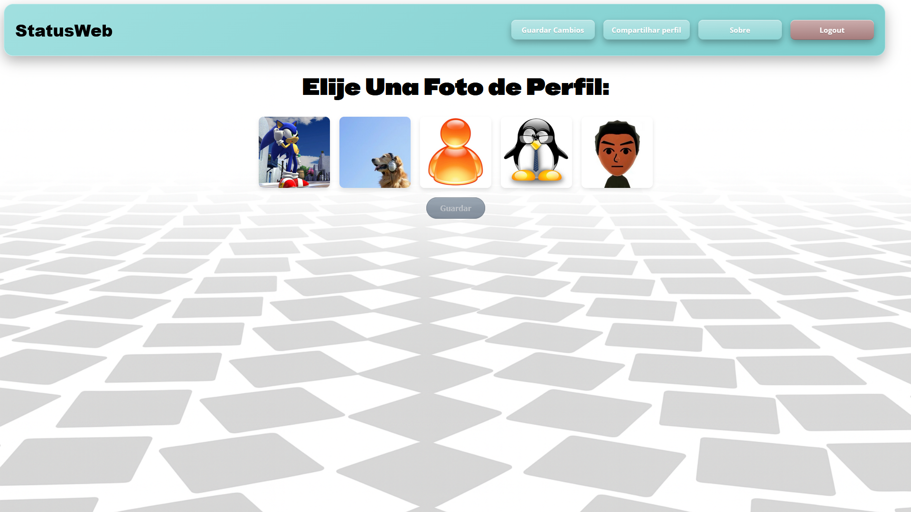
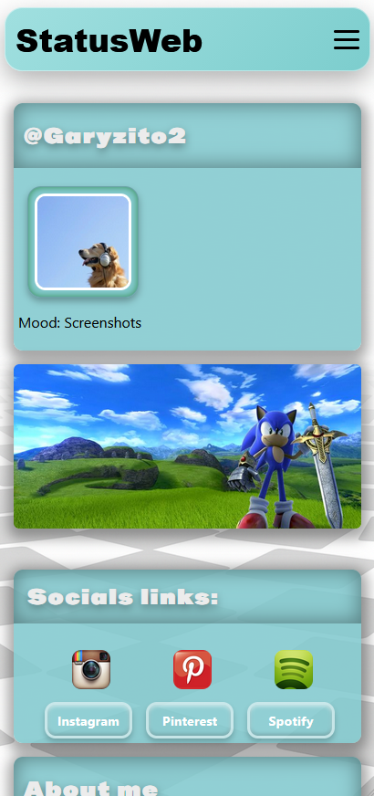

# statusWeb

Modern social platform focused on profile customization, interaction and visual identity.

## About the project

statusWeb is a fullstack web application inspired by modern social platforms, focused on customizable profiles, authentication systems and interactive user experiences.

The project was created to improve my backend and frontend development skills while building a real application using Node.js, Express, Handlebars and SQL databases.

## Features

* User authentication
* Login and registration system
* Editable user profiles
* Custom profile photos
* Personalized biographies
* Responsive interface
* Dashboard system
* Dynamic rendering with Handlebars
* Database integration
* Deploy integration with Render

## Technologies

### Frontend

* HTML
* CSS
* JavaScript
* Handlebars (HBS)

### Backend

* Node.js
* Express.js
* Sequelize

### Database

* MySQL
* PostgreSQL

### Responsive Design

* Extensive use of CSS media queries
* Mobile-first adaptations
* Responsive layouts for different screen sizes

### Tools

* Git
* GitHub
* Render
* VSCode

## Screenshots

<p align="center">
  
  
</p>

<p align="center">
  
  
</p>

<p align="center">
  
  
  
</p>

## Running locally

```bash
git clone https://github.com/YOUR_USERNAME/statusWeb.git
cd statusWeb
npm install
npm start
```

## Live Demo

<a href="https://statusweb.onrender.com" target="_blank">
  
</a>


## Future improvements

* Dark mode
* Real-time notifications
* Friend system
* Posts and comments
* Profile themes
* Image upload system

## Author

Gary García

GitHub:
https://github.com/GaryGarcia2703
